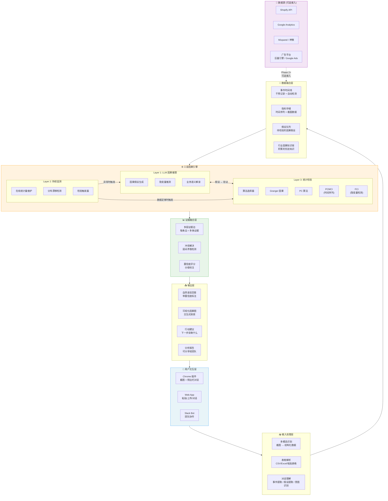
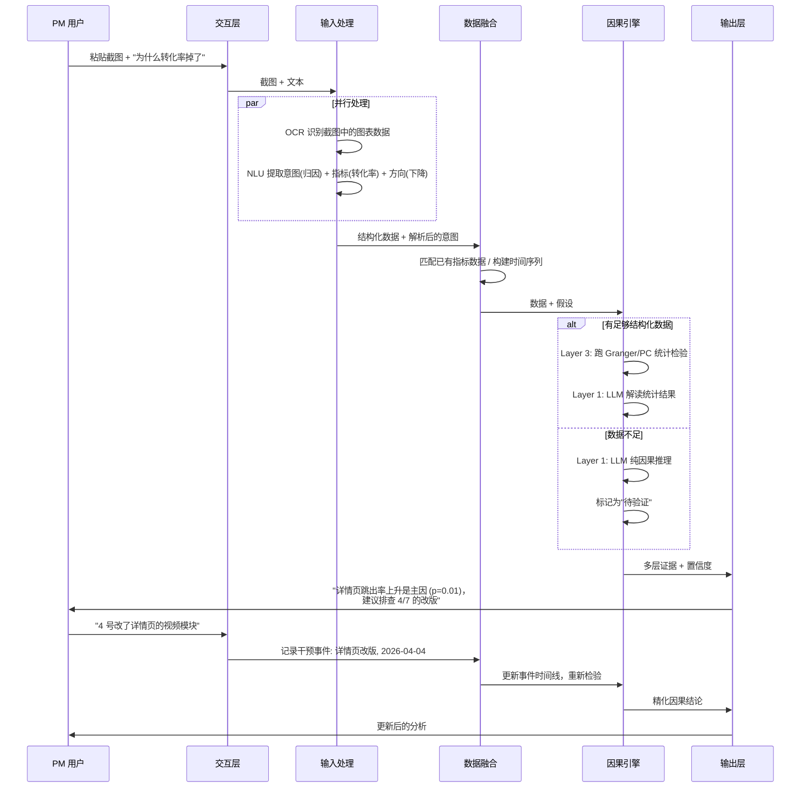
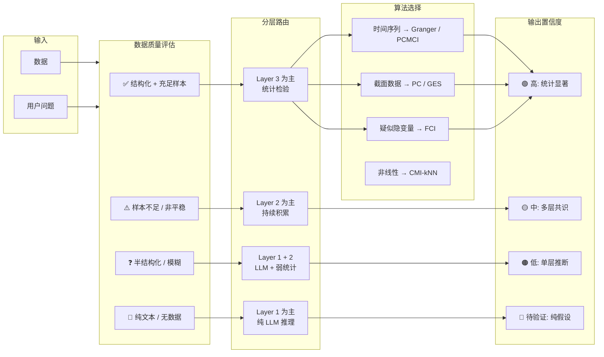
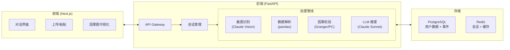

# CurioCat — PM 因果决策助手产品计划

## 一、产品定位

**一句话描述**：帮 PM 用数据做对决策的因果分析助手——截图、粘贴、聊天，零门槛获得有统计支撑的因果洞察。

**核心价值**：你做的每个调整，系统自动告诉你到底有没有用。

**目标用户**：电商 PM / 运营 / 增长负责人

**关键差异化**：

- vs 纯 BI 工具（神策/Mixpanel）：BI 告诉你"发生了什么"，CurioCat 告诉你"为什么发生"
- vs 纯 LLM（直接问 ChatGPT）：LLM 给猜测，CurioCat 给证据
- vs 专业因果发现平台：需要数据工程师部署，CurioCat 截图就能用

---

## 二、系统架构

### 2.1 总体架构图



### 2.2 数据流详图



### 2.3 因果引擎内部流转



---

## 三、技术栈

### 3.1 后端

| 组件         | 技术选型                                  | 理由                        |
| ---------- | ------------------------------------- | ------------------------- |
| API 框架     | FastAPI (Python)                      | 异步、因果库生态都是 Python         |
| LLM 调用     | Claude API (claude-sonnet)            | 性价比最优，多模态支持截图识别           |
| 统计因果引擎     | 自建（基于本项目 tigramite 裁剪版）+ causal-learn | 轻量场景用 causal-learn，大规模用自建 |
| 表格解析       | pandas + openpyxl                     | 标准选择                      |
| OCR / 图表识别 | Claude Vision (多模态)                   | 直接用 LLM 识别截图，省一个 OCR 服务   |
| 任务队列       | Celery + Redis                        | 异步跑因果检验                   |
| 数据库        | PostgreSQL + TimescaleDB              | 时间序列指标存储                  |
| 缓存         | Redis                                 | 会话状态、因果检验缓存               |

### 3.2 前端

| 组件        | 技术选型                  | 理由                      |
| --------- | --------------------- | ----------------------- |
| Web App   | Next.js + TailwindCSS | 快速开发                    |
| Chrome 插件 | Plasmo framework      | React-based Chrome 插件框架 |
| 因果图可视化    | D3.js / react-flow    | 交互式有向图                  |
| 图表        | Recharts              | 时间序列展示                  |

### 3.3 基础设施

| 组件           | 技术选型                       | 月成本估算                 |
| ------------ | -------------------------- | --------------------- |
| 服务器          | AWS t3.medium (2vCPU, 4GB) | ~$30                  |
| 数据库          | RDS PostgreSQL t3.micro    | ~$15                  |
| Redis        | ElastiCache t3.micro       | ~$15                  |
| LLM API      | Claude Sonnet              | ~$0.10-0.50/次查询       |
| CDN / 前端     | Vercel                     | 免费~$20                |
| **MVP 总月成本** |                            | **~$80-150 + LLM 按量** |

---

## 四、MVP 设计 (Phase 1)

### 4.1 功能范围

**做：**

- [x] Web 对话界面：粘贴截图/表格 + 自然语言提问
- [x] 截图识别：自动提取图表中的数据
- [x] CSV/Excel 上传与解析
- [x] 轻量因果检验：Granger 因果、PC 算法（CPU，< 50 变量）
- [x] LLM 因果推理：无数据时纯推理，有数据时解读统计结果
- [x] 置信度分级标注
- [x] 对话历史：积累用户的事件记录和因果知识

**不做（留给后续 Phase）：**

- [ ] 数据源 API 接入
- [ ] Chrome 插件
- [ ] Layer 2 持续监测
- [ ] FCI 隐变量检测
- [ ] 团队协作 / Slack Bot

### 4.2 核心用户流程

```
用户打开 CurioCat Web App
    │
    ├── 场景 A: 有数据
    │   ├── 上传 CSV / 粘贴表格 / 截图
    │   ├── 问: "哪个因素导致了转化率下降？"
    │   ├── 系统: 解析数据 → 跑统计检验 → LLM 解读
    │   └── 输出: 因果结论 + 置信度 + 可视化因果图
    │
    ├── 场景 B: 无数据，有上下文
    │   ├── 描述: "我们改了定价和包装，销售额涨了"
    │   ├── 系统: LLM 因果推理 → 给出分析框架
    │   └── 输出: 最可能的因果路径 + 需要验证的点
    │
    └── 场景 C: 追问式分析
        ├── 基于前面的对话继续深入
        ├── 系统: 积累上下文 → 精化因果图
        └── 用户补充信息 → 系统更新结论
```

### 4.3 MVP 技术架构



---

## 五、分阶段路线图

### Phase 1: MVP — 验证需求 (Month 1-2)

```
目标: 验证 PM 是否愿意为因果分析付费
指标: 100 个注册用户，20 个周活，5 个付费意向

功能:
  ✅ Web 对话界面
  ✅ 截图/表格数据识别
  ✅ 轻量统计因果检验 (Granger, PC)
  ✅ LLM 因果推理 + 解读
  ✅ 置信度分级

技术投入: 1 全栈 + 利用现有 tigramite 代码
成本: ~$150/月基础设施 + LLM 按量
```

### Phase 2: 产品化 — 降低摩擦 (Month 3-4)

```
目标: PMF 验证，首批付费用户
指标: 50 付费用户，MRR $5K

新增功能:
  ✅ Chrome 插件 (一键截图分析)
  ✅ 数据源接入: Shopify, GA (OAuth 一键授权)
  ✅ 事件时间线: 自动 + 手动记录干预事件
  ✅ 定期推送: "上周你的调整效果如何"
  ✅ 分析报告导出

技术投入: +1 前端
成本: ~$300/月
```

### Phase 3: 深化引擎 (Month 5-7)

```
目标: 提升分析准确度，建立壁垒
指标: 200 付费用户，MRR $20K

新增功能:
  ✅ Layer 2 持续监测 (在线统计量、漂移检测)
  ✅ FCI 隐变量检测
  ✅ 算法自动选择 (根据数据特征)
  ✅ 行业因果知识库 v1 (从用户反馈积累)
  ✅ Slack Bot 集成

技术升级:
  - 从 causal-learn 迁移核心检验到自建引擎
  - 加入 PCMCI 支持时间序列场景
```

### Phase 4: 团队版 + 规模化 (Month 8-12)

```
目标: 企业客户，规模化增长
指标: 1000 付费用户，MRR $100K

新增功能:
  ✅ 团队协作: 共享因果图、评论、审批
  ✅ 更多数据源: 抖店、有赞、Mixpanel、神策
  ✅ 自定义数据接入 (通用 SQL / API connector)
  ✅ 三层完整架构上线
  ✅ 因果知识库 v2 (跨客户匿名聚合)

定价:
  Free:  20 次/月
  Pro:   $29/月 (个人)
  Team:  $99/月 (5 人)
  Biz:   $299/月 (不限人数 + 数据接入)
```

---

## 六、定价模型

| 套餐       | 价格     | 目标用户       | 包含内容                          |
| -------- | ------ | ---------- | ----------------------------- |
| Free     | $0     | 体验用户       | 20 次查询/月，仅 LLM 推理             |
| Pro      | $29/月  | 个人 PM      | 不限查询，统计检验，截图分析                |
| Team     | $99/月  | PM 团队 (5人) | Pro 全部 + 共享因果图 + 数据源接入        |
| Business | $299/月 | 企业         | Team 全部 + 不限人数 + 自定义接入 + 持续监测 |

**单位经济:**

- 每次查询 LLM 成本: ~$0.10-0.30
- Pro 用户月均查询: ~60 次
- 单用户月均 LLM 成本: ~$6-18
- 毛利率: ~40-80%

---

## 七、风险与应对

| 风险             | 严重程度 | 应对策略                            |
| -------------- | ---- | ------------------------------- |
| PM 不理解"因果"概念   | 高    | 永远不说"因果发现"，说"帮你搞清楚为什么"          |
| 截图 OCR 不准      | 中    | 用 Claude Vision 而非传统 OCR；允许用户修正 |
| 统计结果与 LLM 判断冲突 | 中    | 透明展示两层结论，让用户判断                  |
| 用户期望 100% 准确   | 高    | 置信度分级是核心 UX，始终诚实标注              |
| 数据安全顾虑         | 高    | 本地处理优先；企业版可私有部署                 |
| LLM 成本随用量增长    | 中    | 缓存相似查询；Sonnet/Haiku 分级调用        |

---

## 八、竞对分析

| 竞品                   | 做法             | CurioCat 差异     |
| -------------------- | -------------- | --------------- |
| ChatGPT / Claude 直接问 | 纯 LLM 猜测，无统计支撑 | 有统计检验做底层验证      |
| 神策 / Mixpanel        | BI 看板，只展示相关性   | 区分因果 vs 相关，给出归因 |
| CausalNex (McKinsey) | 专业因果发现，需要数据工程师 | 零门槛，截图就能用       |
| DoWhy (Microsoft)    | Python 库，需要编程  | 面向非技术 PM 的产品化包装 |

**定位**: BI 和专业因果发现之间的空白地带——比 BI 更深（因果而非相关），比专业工具更易用（截图而非编程）。

---

## 九、核心指标

### 北极星指标

**周活用户的因果查询次数** — 反映产品是否真正融入 PM 工作流

### 辅助指标

| 阶段      | 指标            | 目标     |
| ------- | ------------- | ------ |
| Phase 1 | 注册→首次查询转化率    | > 60%  |
| Phase 1 | 用户回访率（7日）     | > 30%  |
| Phase 2 | 免费→付费转化率      | > 5%   |
| Phase 2 | 月均查询次数 (付费用户) | > 40 次 |
| Phase 3 | NPS           | > 40   |
| Phase 4 | 月流失率          | < 5%   |

---

## 十、下一步行动

```
Week 1:
  □ 搭建 FastAPI 后端骨架
  □ 集成 Claude API (多模态 + 对话)
  □ 从 tigramite 抽取轻量 Granger/PC 模块

Week 2:
  □ 搭建 Next.js 前端 (对话 + 上传)
  □ 实现截图 → 数据提取 pipeline
  □ 实现 CSV/表格解析

Week 3:
  □ 串联完整链路: 输入 → 因果检验 → LLM 解读 → 输出
  □ 置信度分级 UI
  □ 因果图可视化 (基础版)

Week 4:
  □ 内测: 找 10 个 PM 试用
  □ 收集反馈，迭代核心体验
  □ 准备 landing page + waitlist
```
